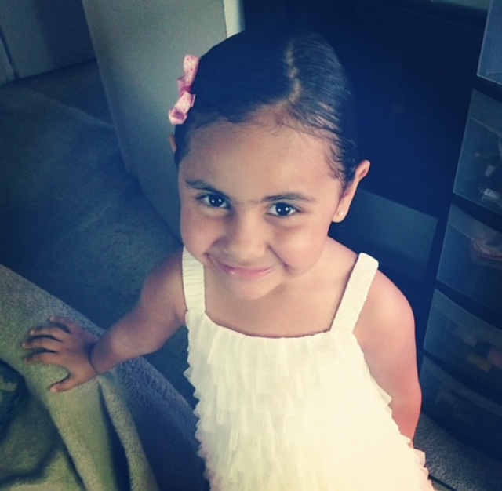

# Unit 4 - Personal Narrative

## Introduction

Images are often used to portray our personal experiences and interests. We also use image filters and effects to change or enhance the mood of an image. When combined into collages and presentations, these images tell a story about who we are and what is important to us. Your goal is to create a personal narrative using The Theater that consists of images of your personal experiences and/or interests, incorporates data related to these experiences and/or interests that can be organized in a 2D array, and uses image filters and effects to change or enhance the mood of your images.

## Requirements

Use your knowledge of object-oriented programming, two-dimensional (2D) arrays, and algorithms to create your personal narrative collage or animation:

- **Create at least two 2D arrays** – Create at least two 2D arrays to store the data that will make up your visualization.
- **Implement one or more algorithms** – Implement one or more algorithms that use loops and two-way or multi-selection statements with compound Boolean expressions to analyze the data.
- **Use Image Filters** - Include multiple image filters learned from this unit, and additionally create new ones of your own.
- **Use methods in the String class** – Use one or more methods in the String class in your program, such as to determine whether the name of an image file contains specific characters.
- **Create a visualization** – Create an image or animation that conveys the story of the data by illustrating the patterns or relationships in the data.
- **Document your code** – Use comments to explain the purpose of the methods and code segments and note any preconditions and postconditions.

## UML Diagram

## Video

https://youtu.be/mibIygeqtLQ

For my thumbnail, I would choose the photo below (having difficulties with the youtube posting/thumbnail part):

## Story Description
My story shows the things most important to me in my life, the first photo being the most special. The first photo is a photo of my little sister, Amelia, and I. She is my best friend, and I know that no matter how many friends I'll lose in life I will always have her by my side. She really does make my days and life better and I could not be more grateful for someone in my whole life. The second photo is a photo of a cat and hello kitty. I find passion in hello kitty and cats, as they are some of my other most favorite things. I love hello kitty everything; hello kitty pajamas, room decor, cups, posters, everything! I also love cats equally as much and I believe that everyone who is close to me knows how much happiness I find in seeing and petting cats, as one day owning 50 cats is my dream. The third photo is a photo I took in a shop in Mexico, and it is representing the love I have for my culture. My culture is something I will never be ashamed of as it is who I am and forever will be. The last and final photo is a photo of my favorite type of food, Asian food! I love all types of food; Mexican, Ttalian, Mediterranean, but my all time favorite will always be Asian food. I truly do believe I could eat it every single day and never become sick of it. I also believe that food can be a way someone expresses themselves. I love when people put hard work into dishes even if it is for themselves and no one else. 

The data that is stored in my 2D arrays are my images for my image animation story. They directly relate to the story in my animation story because the images I used are stored in the 2D arrays. 
## Image Filter Analysis

Choose at least 2 filters uses in your animation to explain how the pixels are modified:
1. Colorshift: One of the filters I used in my project is the color shift filter. This filter gives the pixels in the first image of each 2D array a reddish hue once my code runs.

2. Contrast: Another filter I used was changing the contrast to my images once the program run. When contrast is added to the images, the pixels lack dimension and look 'softer' in a way. 